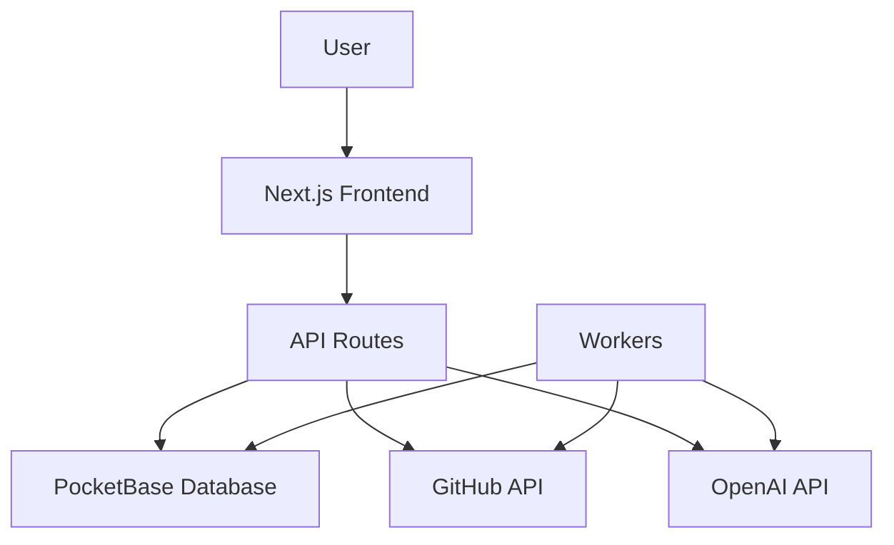

# 🏗️ Architecture

## System Overview

## Components

### Frontend
- **Next.js 16** with App Router and Turbopack
- **Tailwind CSS** with dark Primer-ish palette
- **React** components for scan UI and results display

### Backend
- **API Routes** in Next.js App Router
- **Workers** for async processing (discovery, diff extraction, ranking)
- **PocketBase** as the sole data store

### External Services
- **GitHub API** via `@octokit/rest` + `p-queue` for rate-limit-bounded fan-out
- **OpenAI gpt-4o-mini** (JSON mode) for trait classification

## Data Flow

1. **Discovery** → GitHub API → PocketBase (forks collection)
2. **Diff Extraction** → GitHub API → PocketBase (diffs collection)
3. **Ranking** → PocketBase → PocketBase (forks with scores)
4. **Ask** → OpenAI API → SSE stream to frontend

## Database Schema

### Collections
- `scans` — Repository scan metadata
- `forks` — Fork information with ranking scores
- `diffs` — Diff patches and changed files
- `jobs` — Background job tracking
